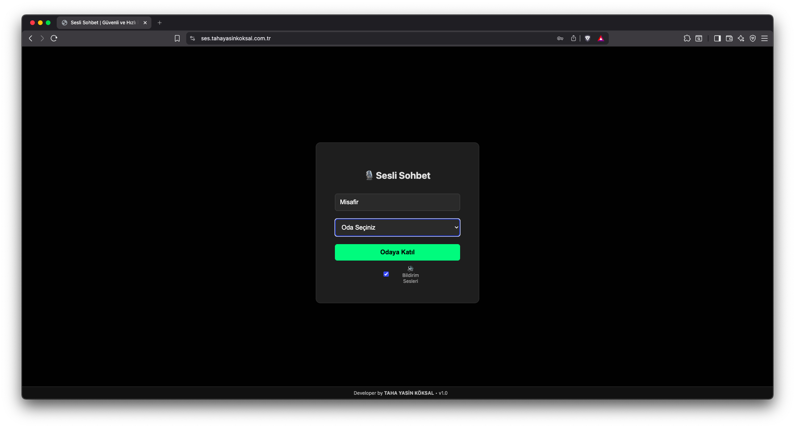
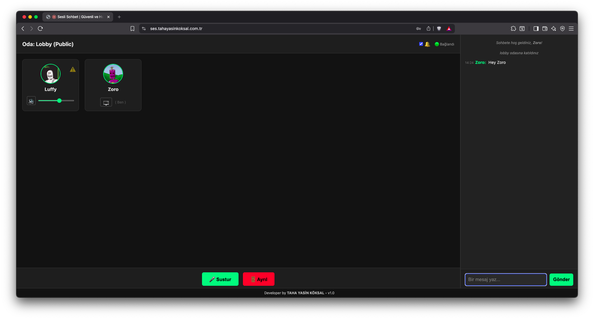
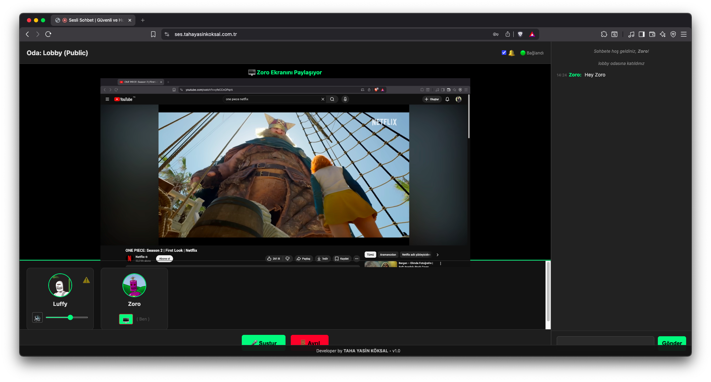
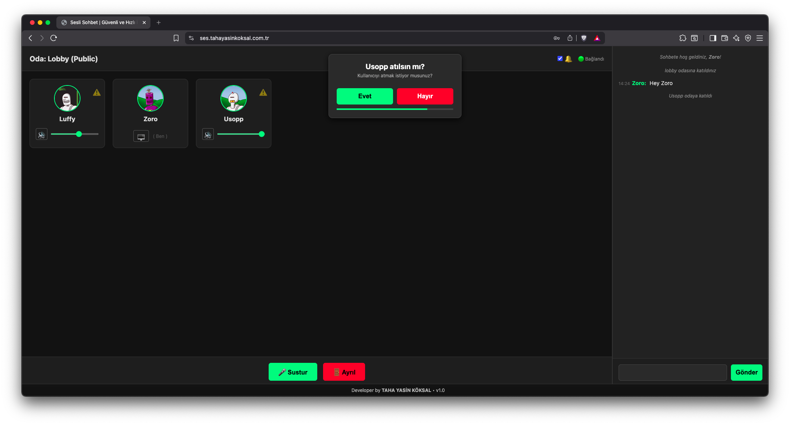
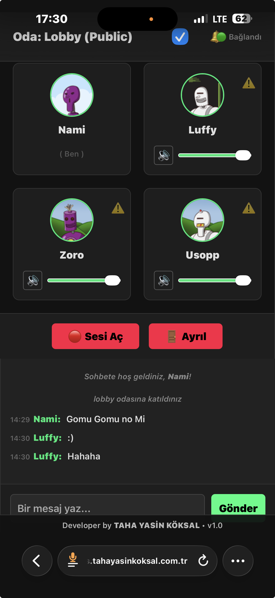

# Open Voice Chat

   

> **Open Voice Chat provides a robust, self-hosted, and peer-to-peer (P2P) solution for communities seeking private and efficient real-time communication. Designed for low-latency voice chat, it ensures direct connections between participants, enhancing privacy, reducing server load, and delivering a seamless, natural conversation experience. Ideal for gaming groups, online communities, and friends who value control over their communication infrastructure and desire a high-quality, secure voice platform.**

---

## 📸 Showcase

| Login Screen | Room View |
| :---: | :---: |
|  |  |

| Screen Share | Vote Kick |
| :---: | :---: |
|  |  |

<div align="center">

**Mobile View**



</div>

---

## ✨ Features

### Core Features
- 📡 **P2P Architecture:** Crystal clear audio via WebRTC Mesh.
- 🖥️ **Screen Sharing:** Cinema mode with System Audio support and fullscreen capability.
- 💬 **Real-time Chat:** Text messaging alongside voice communication.
- 🔒 **Privacy First:** No database, no logs, self-hosted solution.
- ⚡ **Easy Setup:** Docker-ready, no complex configuration required.

### Advanced Features
- 🗳️ **Democracy System:** Vote Kick & IP Ban logic for community moderation.
- 😂 **Reaction System:** Share sound reactions with everyone in the room (dynamic MP3 loading).
- 👥 **Participant List:** See who's in the room with real-time status indicators.
- 🎨 **Modern UI:** Glassmorphism effects, gradient colors, smooth animations.
- 📱 **Mobile Responsive:** Works seamlessly on desktop, tablet, and mobile devices.
- 🔊 **Sound Notifications:** Join/leave notifications with custom MP3 support.
- 🎤 **Listener Mode:** Join as listener if no microphone is available.
- 🔇 **Individual Controls:** Mute/unmute others and adjust individual volume levels.

### Technical Features
- 🌐 **Multi-room Support:** Create and manage multiple rooms with optional passwords.
- 🔐 **Secure Rooms:** Password-protected rooms for private conversations.
- 🎭 **Unique Nicknames:** Automatic name conflict resolution.
- 🚫 **Hot-plug Support:** Detect microphone connection changes in real-time.
- 🇹🇷 **Localization:** Turkish UI support (English README).

---

## 🚀 Installation

### Method 1: Docker Compose (Recommended)

The easiest way to get started is using Docker.

```bash
git clone https://github.com/tahayasinkoksal/open-voice-chat.git
cd open-voice-chat
docker compose up -d
```

The application will be available at `http://localhost:3000`

### Method 2: Manual (Node.js)

If you prefer running it directly with Node.js:

```bash
# Clone repository
git clone https://github.com/tahayasinkoksal/open-voice-chat.git
cd open-voice-chat

# Install dependencies
npm install

# Start the server
npm start
```

---

## ⚙️ Configuration

### Managing Rooms
Rooms and admin passwords are managed in `config/rooms.json`.

```json
[
  {
    "id": "lobby",
    "name": "Lobby (Public)",
    "password": null
  },
  {
    "id": "vip",
    "name": "VIP Room (Private)",
    "password": "admin"
  }
]
```

### Custom Sound Notifications
Place your MP3 files in `public/sounds/`:
- `join.mp3` - Played when someone joins
- `disconnect.mp3` - Played when someone leaves

### Reaction Sounds
Add MP3 files to `public/tepkiler/` for custom reactions:
- File: `ya-sabir.mp3` → Displays as: **"Ya Sabir"**
- File: `vine-boom.mp3` → Displays as: **"Vine Boom"**
- Automatically scanned and loaded on startup

**Naming Convention:** Use hyphens (`-`) to separate words. First letter of each word will be capitalized.

### Environment Variables
You can configure the port in the `.env` file (create it if it doesn't exist):

```env
PORT=3000
```

---

## 🎮 Usage

1. **Join a Room:** Select a room from the dropdown and enter your nickname
2. **Voice Chat:** Your microphone is automatically enabled (grant browser permission)
3. **Screen Share:** Click the screen share button in the header
4. **Fullscreen Mode:** Double-click the shared screen or use the fullscreen button
5. **Send Reactions:** Switch to "Tepkiler" tab and click any reaction sound
6. **Text Chat:** Use the "Sohbet" tab to send text messages
7. **View Participants:** Switch to "Katılımcılar" tab to see who's online
8. **Vote Kick:** Click the ⚠️ button on any user card to start a vote

---

## 🛠️ Tech Stack

- **Backend:** Node.js, Express, Socket.IO
- **WebRTC:** PeerJS for P2P connections
- **Frontend:** Vanilla JavaScript, HTML5, CSS3
- **Deployment:** Docker, Docker Compose

---

## ⚠️ Troubleshooting

### HTTPS Requirement
Browsers require **HTTPS** for Microphone and Screen Sharing access. Options:
- Use [Cloudflare Tunnel](https://www.cloudflare.com/products/tunnel/) (Free)
- Configure [Nginx](https://www.nginx.com/) with SSL
- Test on `localhost` (works without HTTPS)

### Common Issues

**No Sound:**
- Check browser permissions for microphone
- Ensure sound notifications are enabled (🔔 icon)
- Check system volume settings

**Screen Sharing Not Working:**
- Only works on HTTPS or localhost
- Not supported on mobile browsers
- Check browser permissions

**Connection Issues:**
- Verify firewall allows WebRTC connections
- Check if port 3000 is available
- Try different browser (Chrome/Firefox recommended)

---

## 🤝 Contributing

Contributions are welcome! Please feel free to submit a Pull Request.

1. Fork the repository
2. Create your feature branch (`git checkout -b feature/AmazingFeature`)
3. Commit your changes (`git commit -m 'Add some AmazingFeature'`)
4. Push to the branch (`git push origin feature/AmazingFeature`)
5. Open a Pull Request

---

## 📜 License

This project is licensed under the MIT License - see the [LICENSE](LICENSE) file for details.

---

## 👨‍💻 Author

**Taha Yasin Köksal**

- **Website:** [tahayasinkoksal.com.tr](https://tahayasinkoksal.com.tr/)
- **Email:** [info@tahayasinkoksal.com.tr](mailto:info@tahayasinkoksal.com.tr)
- **LinkedIn:** [linkedin.com/in/tahayasinkoksal](https://www.linkedin.com/in/tahayasinkoksal)
- **Google Play:** [Developer Profile](https://play.google.com/store/apps/dev?id=6116510173531123977)
- **Apple App Store:** [Developer Profile](https://apps.apple.com/tr/developer/taha-yasin-koksal/id1516777761)

---

## 🙏 Acknowledgments

- WebRTC community for excellent documentation
- PeerJS for simplifying P2P connections
- All contributors and users of this project

---

<div align="center">

**Made with ❤️ by Taha Yasin Köksal**

⭐ Star this repository if you find it helpful!

</div>
